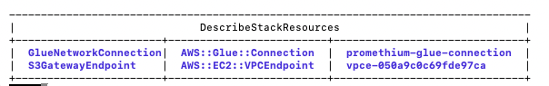

# Private S3 Access for Trino + Glue Crawlers

Documentation and the CloudFormation template that enable Promethium to connect to S3 privately using a VPC endpoint and Glue NETWORK connection. This setup ensures:

1. No traffic to S3 goes over the public internet
2. Access is restricted by VPC, IAM, and bucket policy
3. Promethium does not require elevated IAM permissions

## Overview
The IE Trino pod (via IRSA) and Glue crawlers share the same private path:

Trino (EKS pod via IRSA) → HTTPS (private) → VPC route tables → S3 Gateway VPC Endpoint → Amazon S3

Glue crawlers use the same VPC path but additionally need:
- A Glue network connection
- A private subnet + security group
- Permission to create Elastic Network Interfaces (ENIs)

## Prerequisites
Before running the template you must already have:

- VPC ID used by the IE deployment.
- Private subnet(s) for EKS and Glue (and their AZs).
- Route tables associated with those subnets.
- Security group that allows outbound HTTPS (TCP 443).
- IAM roles for IRSA (Trino) and Glue crawler with permissions to read/write the target bucket.
 - Glue NETWORK connection ENI permissions (via role policies).

## Setup
To establish the private VPC path you provision the following two resources in the AWS deployment where the IE is installed:

- **S3 Gateway VPC Endpoint**
  - Attach to the desired route tables.
  - Optionally apply a restrictive endpoint policy (e.g., limit to specific buckets or principals).
- **Glue NETWORK Connection**
  - Bind to a private subnet (determines the AZ) and the security group that allows outbound HTTPS.
  - Glue crawlers use this connection to reach S3 privately through the endpoint.

### Deployment

`AWS/utilities/install_vpc_endpoint.sh` wraps the CloudFormation call with automated waiting and reporting:

```bash
./AWS/utilities/install_vpc_endpoint.sh \
  --region us-east-1 \
  --stack-name s3-cross-account-permissions \
  --template-file AWS/CFT/s3-private-crawler/promethium-vpc-s3-glue-connection.yaml \
  --parameters \
    VpcId=vpc-06555a613f7aa0c8d \
    RouteTableIds=rtb-0eeee506c49b048c8 \
    SubnetId=subnet-0e5b016b329ce26c0 \
    AvailabilityZone=us-east-1b \
    SecurityGroupIds=sg-0172b181a9e901d39 \
    AwsRegion=us-east-1 \
    AddEndpointPolicy=false \
    AllowedBucketArns='' \
    GlueConnectionName=promethium-glue-connection \
    GlueConnectionDescription="Glue network connection for Promethium crawler"
```
After stack creation note the generated VPC endpoint ID (for your bucket policy) and the Glue connection name (to stitch into Promethium's glue-service deployment) -



The script prints creation progress, lists the created resources on success, and reports failure reasons (exits non-zero) if the stack fails.

If you need to delete the stack later, rerun the same script with `--delete-stack`:

```bash
./AWS/utilities/install_vpc_endpoint.sh \
  --region us-east-1 \
  --stack-name s3-cross-account-permissions \
  --delete-stack
```

The deletion path prints failure events (if any) and exits non-zero when the delete fails.


## Post-deployment
- Update the S3 bucket policy so the VPC endpoint ID is allowed to access the bucket. 

```json
{
    "Version": "2012-10-17",
    "Statement": [
        {
            "Sid": "AllowGlueListBucketViaVpcEndpoint",
            "Effect": "Allow",
            "Principal": {
                "AWS": <role ARN for Trino OIDC role> eg - "arn:aws:iam::734236616923:role/promethium-qa-s3testing6-trino-oidc-role"
            },
            "Action": "s3:ListBucket",
            "Resource": "arn:aws:s3:::pm61data3",
            "Condition": {
                "StringEquals": {
                    "aws:SourceVpce": <VPC Endpoint id from above command's output eg- "vpce-0f932f36ee0ae56c6"
                },
                "StringLike": {
                    "s3:prefix": [
                        "<bucket prefix>",
                        "<bucket prefix>/",
                        "<bucket prefix>/*"
                    ]
                }
            }
        },
        {
            "Sid": "AllowGlueGetObjectViaVpcEndpoint",
            "Effect": "Allow",
            "Principal": {
                "AWS": <role ARN for Trino OIDC role> eg - "arn:aws:iam::734236616923:role/promethium-qa-s3testing6-trino-oidc-role"
            },
            "Action": "s3:GetObject",
            "Resource": "arn:aws:s3:::<bucketname>/<bucket prefix>/*",
            "Condition": {
                "StringEquals": {
                    "aws:SourceVpce": <VPC Endpoint id from above command's output eg- "vpce-0f932f36ee0ae56c6"
                }
            }
        }
    ]
}
```

- Update Promethium's glue-service deployment (and/or Glue crawler definition) with the Glue connection name from the stack.
```json
kubectl set env deployment/glue-crawler \
  GLUE_USE_VPC_CONNECTION=false \
  GLUE_VPC_CONNECTION_NAME="<connection name from above step>" \
  -n intelligentedge
  ```

## Template location
See `promethium-vpc-s3-glue-connection.yaml` in this folder for the Terraform template that provisions the endpoint and Glue connection resources.
