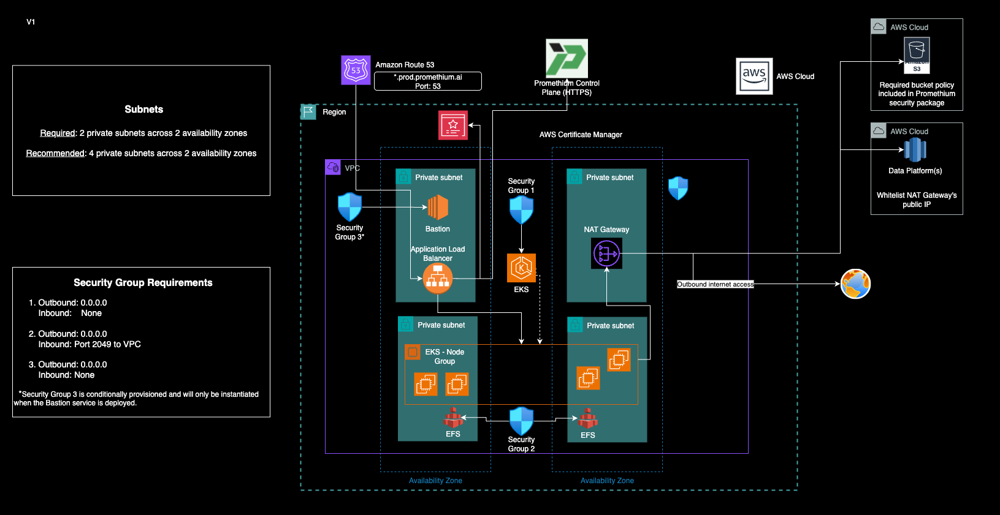

# ✅ Promethium Intelligent Edge Installation (AWS)

The following steps will describe how to deploy a secure Promethium Intelligent Edge in AWS. It will deploy an Amazon Elastic Kubernetes Service (EKS) within use the Promethium Application services will be deployed. The deployment will configure the following footprint;



## 📋 1. Environment Prerequisites

| Item                    | Description                                                                 |
|-------------------------|-----------------------------------------------------------------------------|
| AWS Account             | Identify the AWS account where the data plane will be deployed              |
| Region                  | AWS region for deployment (e.g., `us-east-1`)                       |
| VPC                     | VPC ID that is at least /22 that will contain the Promethium Intelligent Edge |
| 3+ Private subnets      | Subnets (/24) that will support the kubernetes cluster |
| Outbound Internet Access| Ensure EKS nodes have HTTPS access to Promethium Control Plane + image registry |
| DNS & Ingress           | Allow cloud-native ingress (ALB) creation and domain assignment         |
| S3 Bucket               | Storage location for state persistence and materialized Datamaps |
| Company Name            | This is a variable <company_name> that is used in a number of the scripts in this guide. Please liaise with your Promethium technical representative to agree on the value for this variable. |

---

## 🔐 2. IAM Roles & Policies

Create the following IAM roles and policies using Promethium-provided templates. Ensure all roles and policies are tagged (e.g., `Service=PromethiumIE`). The roles policies in this repo have placeholders for the AWS account ID and AWS region that the IE will be deployed to. Post cloning this repository you can the the utility [update-policies.sh](utilities/update-policies.sh) to add the AWS account ID and the AWS region to the policies that have placeholders.

### 🚀 Usage

`python3 tf_install_role_verifier <Need to fill in parameters>`

| Parameter | Description | Example |
| --------- | ----------- | ------- |
|  |  |  |
|  |  |  |
|  |  |  |

| Resource | What uses it | Attached Policies | Trust Policies | Notes |
|----------|--------------|-------------------|----------------|-------|
| `PromethiumInstall`   | Install VM | <ul><li> [promethium-terraform-acm-policy.json](iam_policy_templates/promethium-terraform-acm-policy.json) </li> <li>[promethium-terraform-ec2-policy.json](iam_policy_templates/promethium-terraform-ec2-policy.json)</li> <li>[promethium-terraform-efs-policy.json](iam_policy_templates/promethium-terraform-efs-policy.json) </li> <li> [promethium-terraform-eks-policy.json](iam_policy_templates/promethium-terraform-eks-policy.json)</li> <li>[promethium-terraform-elb-permissions.json](iam_policy_templates/promethium-terraform-elb-permissions.json)</li> <li>[promethium-terraform-glue-policy.json](iam_policy_templates/promethium-terraform-glue-policy.json)</li> <li> [AmazonSSMManagedInstanceCore](https://docs.aws.amazon.com/aws-managed-policy/latest/reference/AmazonSSMManagedInstanceCore.html)</li> </ul> | [promethium-terraform-install-role-trust-policy.json](iam_policy_templates/promethium-terraform-install-role-trust-policy.json) | This role needs to be created as an **Instance Profile Role**. It will be attached to the install VM required to install Promethium Intelligent Edge (IE)|
| `promethium-efscsi-role` | Promethium Intelligent Edge (IE) | <ul> [promethium-efscsi-policy.json](iam_policy_templates/promethium-efscsi-policy.json) </ul> | [promethium-efscsi-role-trust-policy.json](iam_policy_templates/promethium-efscsi-role-trust-policy.json) | Allows EFS CSI driver in the EKS cluster to provision and manage EFS file systems and access points|
| `promethium-eks-autoscaler-role` | Promethium Intelligent Edge (IE) |  <ul> [promethium-eks-autoscaler-policy.json](iam_policy_templates/promethium-eks-autoscaler-policy.json) </ul>| [promethium-eks-autoscaler-role-trust-policy.json](iam_policy_templates/promethium-eks-autoscaler-role-trust-policy.json) | Allows EKS Autoscaler to add or remove worker nodes in Auto Scaling Groups and inspect EC2 and EKS resources to make scaling decisions |
| `promethium-lbcontroller-role` | Promethium Intelligent Edge (IE) | <ul> [promethium-lbcontroller-policy.json](iam_policy_templates/promethium-lbcontroller-policy.json) </ul> | [promethium-lbcontroller-role-trust-policy.json](iam_policy_templates/promethium-lbcontroller-role-trust-policy.json) | Allows the Load Balancer Controller running the EKS cluster to provision and manage ALBs/NLBs and related networking/security resources on behalf of Kubernetes LoadBalancer ingresses and services |
| `promethium-s3-access-role` | Promethium Intelligent Edge (IE) | <ul> [promethium-s3-access-policy.json](iam_policy_templates/promethium-s3-access-policy.json) </ul>| [promethium-s3-access-role-trust-policy.json](iam_policy_templates/promethium-s3-access-role-trust-policy.json) | Allows for postgres backups into S3 and pull container images from ECR |
| `promethium-eks-cluster-role` | Promethium Intelligent Edge (IE) | <ul><li> [AmazonEKSClusterPolicy](https://docs.aws.amazon.com/aws-managed-policy/latest/reference/AmazonEKSClusterPolicy.html) </li> <li>  [AmazonEKSVPCResourceController](https://docs.aws.amazon.com/aws-managed-policy/latest/reference/AmazonEKSVPCResourceController.html) </li> </ul>| [promethium-eks-cluster-role-trust-policy.json](iam_policy_templates/promethium-eks-cluster-role-trust-policy.json) | Gives the EKS control plane permissions to run the cluster, manage AWS infrastructure, and  manage pod-level networking |
| `promethium-trino-oidc-role` | Promethium Intelligent Edge (IE) | <ul> [promethium-trino-glue-policy.json](iam_policy_templates/promethium-trino-glue-policy.json) </ul> | [promethium-trino-oidc-role-trust-policy.json](iam_policy_templates/promethium-trino-oidc-role-trust-policy.json)| Query and manage data in Glue Data Catalog and S3. Handle KMS encrypted data and launch and interact with Glue jobs using default service role |
| `promethium-eks-worker-role` | Promethium Intelligent Edge (IE) | <ul><li> [promethium-efscsi-policy.json](iam_policy_templates/promethium-efscsi-policy.json)</li> <li>[promethium-eks-kms-access-policy.json](iam_policy_templates/promethium-eks-kms-access-policy.json) </li> <li> [AmazonEC2ContainerRegistryReadOnly](https://docs.aws.amazon.com/aws-managed-policy/latest/reference/AmazonEC2ContainerRegistryReadOnly.html)</li> <li> [AmazonEKS_CNI_Policy](https://docs.aws.amazon.com/aws-managed-policy/latest/reference/AmazonEKS_CNI_Policy.html)</li><li> [AmazonEKSWorkerNodePolicy](https://docs.aws.amazon.com/aws-managed-policy/latest/reference/AmazonEKSWorkerNodePolicy.html)</li><li> [AmazonSSMManagedInstanceCore](https://docs.aws.amazon.com/aws-managed-policy/latest/reference/AmazonSSMManagedInstanceCore.html)</li></ul>| [promethium-eks-worker-role-trust-policy.json](iam_policy_templates/promethium-eks-worker-role-trust-policy.json) | EKS worker node IAM role to mount and manage EFS volumes (via CSI driver). Uses KMS keys for encrypted EFS volumes. Allows image pulls, network management within EKS|
| `promethium-ebscsi-role` | Promethium Intelligent Edge (IE) | <ul><li>[promethium-eks-kms-access-policy.json](iam_policy_templates/promethium-eks-kms-access-policy.json)</li><li> [AmazonEBSCSIDriverPolicy](https://docs.aws.amazon.com/aws-managed-policy/latest/reference/AmazonEBSCSIDriverPolicy.html)</li></ul>| [promethium-ebscsi-role-trust-policy.json](iam_policy_templates/promethium-ebscsi-role-trust-policy.json)| Allows the EKS EBS CSI driver to provision, attach, delete, and snapshot encrypted EBS volumes in your cluster using your KMS keys. |

---

## 🧪 4. Subnet Tagging

The subnets that will support the EKS cluster need to have a series of tags. The tags are

| Key | Value |
| --- | ----- |
| promethium-datafabric-prod-<company_name>-eks-cluster | owned |
| kubernetes.io/role/internal-elb | 1 |

The utility [tag_subnets.sh](utilities/tag_subnets.sh) will apply these tags.

### 🚀 Usage

`./tag-subnets.sh <vpc_id> <region> <company_name>`

| Parameter | Description | Example |
| --------- | ----------- | ------- |
| vpc_id | The ID of the VPC | vpc-0abc123de456fghij |
| region | The AWS region the VPC is located in | us-east-1 |
| company_name | The variable <company_name> that is used through this install process | acme |

---

## 🧪 5. Role and Policy Validation

The following utilities can be used to verify that the roles created have the requisite permissions to execute the installation process.

| Utility | Purpose |
|------------------------------------------------|---------------|
| update-policies.sh | Update the role and trust policies with account and region details |
| tf_install_role_verifier.py | Verifies permissions associated with PromethiumInstall role |
| promethium_app_role_verifier.py | Verifies roles needed for Promethium Intelligent Edge functioning |
| promethium_iam_check.py | Checks IAM permissions required for Promethium IE installation.

---

### Promethium IAM Check
The [promethium_iam_check.py](./utilities/promethium_iam_check.py) utility checks IAM permissions required for Promethium IE installation. It simulates the policies for a given IAM role, user, or group and checks if the required actions are allowed on the specified resources.

```
$ python promethium_iam_check.py arn region policy [-h] [--profile PROFILE] [--group] [--debug]
    <arn> is the AWS IAM role, user, or group
    <region> is the AWS region
    <policy> is the specific json IAM policy file to test, or enter 'all' to test all policies in this repo.
    --profile : AWS profile name to select account settings
    --group : runs the policy checker per action (instead of per group)
    --debug : enables debug output
```

Example: run it with iam role in us-east-1, on the eks json policy file in this repo:

```
python promethium_iam_check.py \
    arn:aws:iam::734236616923:role/promethium-terraform-aws-provider-ie-role \
    us-east-1 \
    ../iam_policy_templates/promethium-terraform-eks-policy.json

...
Denied actions (2):
  - eks:ListUpdates on arn:aws:eks:us-east-1:role:cluster/promethium*
  - eks:TagResource on arn:aws:eks:us-east-1:role:cluster/promethium*
Summary: Tested 23 actions, Allowed: 21, Denied: 2
```

Example: run it with iam role in us-east-1, on every json policy file in this repo:

```
python promethium_iam_check.py \
    arn:aws:iam::646322277713:role/promethium-terraform-aws-provider-ie-role \
    us-east-1 \
    all \
    --profile sandbox

...
Summary: Tested 263 actions, Allowed: 159, Denied: 104
```
