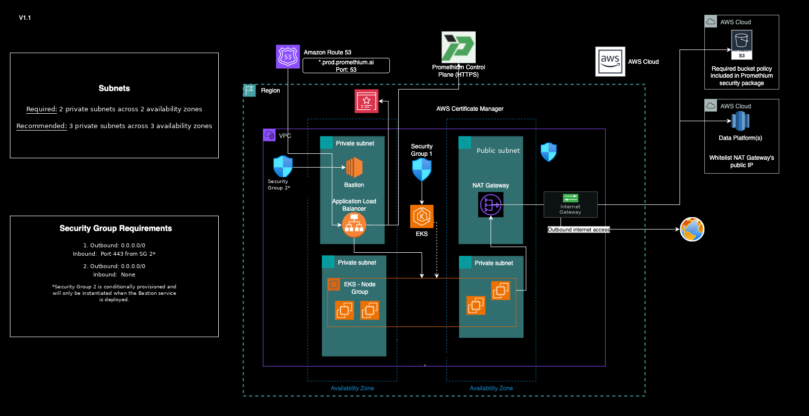

# Promethium Intelligent Edge Installation (AWS)



The following steps describe how to deploy a secure Promethium Intelligent Edge on AWS. It will deploy an Amazon Elastic Kubernetes Service (EKS) cluster within which the Promethium application services are deployed, fronted by an AWS Application Load Balancer (ALB).

---

## 1. Deployment Modes

Promethium supports two deployment modes depending on how much of the AWS infrastructure your organisation manages directly.

| Mode | VPC | IAM Roles | Who runs it |
|------|-----|-----------|-------------|
| **Mode 1 — VPC Only** | Customer-provided | Promethium Terraform creates all roles | Promethium associate |
| **Mode 2 — VPC + Base IAM** | Customer-provided | Customer creates EKS cluster & worker roles; Promethium Terraform creates OIDC/IRSA roles | Promethium associate |

> Your Promethium technical representative will confirm which mode applies to your environment before the installation begins.

For detailed step-by-step installation instructions, your Promethium associate will follow:
- [Mode 1 — VPC Only](README-vpc-only.md)
- [Mode 2 — VPC + Base IAM](README-mode2-vpc-base-iam.md)

---

## 2. Environment Prerequisites

| Item | Description |
|------|-------------|
| AWS Account | The AWS account where the Promethium Intelligent Edge will be deployed |
| Region | AWS region for deployment (e.g., `us-east-1`) |
| VPC | An existing VPC of at least `/22` CIDR, or allow Promethium to create one using the [network CloudFormation template](CFT/network.yaml) |
| Private Subnets | 2 private subnets (minimum `/24`) across 2 availability zones — for EKS worker nodes |
| Public Subnets | 2 public subnets across 2 availability zones — for the Application Load Balancer |
| Outbound Internet Access | The install VM and EKS nodes require outbound HTTPS access — see Networking Requirements below |
| Company Name | A `<company_name>` variable used throughout the deployment. Agree on this value with your Promethium technical representative before starting — max 15 characters, lowercase, no spaces |
| GitHub PAT | A GitHub Personal Access Token with `read:packages` scope to pull private Terraform modules and Helm charts (provided by Promethium) |
| Promethium Image Tag | Application release version (e.g., `24.2.2`) — provided by Promethium |

### Subnet Requirements

| Subnet | Count | Availability Zones | Routing | Purpose |
|--------|-------|--------------------|---------|---------|
| Private | 2 | 2 different AZs | NAT Gateway | EKS worker nodes |
| Public | 2 | 2 different AZs | Internet Gateway | Application Load Balancer |

> **Note:** AWS Application Load Balancer requires subnets in at least 2 availability zones. A single public subnet will cause ALB provisioning to fail.

> **Note:** EKS worker nodes must be in private subnets only. Public subnets auto-assign public IPs to instances, which causes EKS node group creation to fail.

If you do not have an existing VPC, Promethium provides a [network CloudFormation template](CFT/network.yaml) that creates all required networking resources automatically.

### Networking Requirements

#### Install VM — Outbound Access

The install VM must reach the following endpoints over HTTPS (port 443) during deployment:

| Endpoint | Purpose |
|----------|---------|
| `github.com`, `*.githubusercontent.com` | Clone Terraform wrapper repo, download tools |
| `ghcr.io` | Pull Helm charts from GitHub Container Registry |
| `releases.hashicorp.com` | Download Terraform binary |
| `registry.terraform.io` | Terraform provider and module downloads |
| `dl.k8s.io` | Download kubectl |
| `*.amazonaws.com` | AWS API endpoints (EKS, EC2, IAM, S3, ACM, Route 53) |
| `sts.amazonaws.com` | AWS STS assume-role |
| `pypi.org`, `files.pythonhosted.org` | Python boto3 package |

#### EKS Nodes — Outbound Access

EKS nodes require outbound access for cluster operations and to pull Promethium container images:

| Endpoint | Port | Purpose |
|----------|------|---------|
| `*.eks.amazonaws.com` | 443 | EKS API server communication |
| `*.ecr.us-east-1.amazonaws.com` | 443 | Promethium container images (AWS ECR) |
| `api.ecr.*.amazonaws.com` | 443 | ECR authentication API |
| `sts.amazonaws.com` | 443 | AWS STS for ECR token refresh |
| `ghcr.io` | 443 | Promethium Helm charts |
| `s3.amazonaws.com`, `*.s3.amazonaws.com` | 443 | S3 access for EKS and application data |

#### DNS

If your VPC uses custom DNS servers, ensure they can resolve all AWS service endpoints and `ghcr.io`. Misconfigured DNS is a common cause of failures during `terraform init` and Helm chart pulls.

---

## 3. IAM Roles — CloudFormation Templates

Promethium provides CloudFormation templates for creating all required IAM roles. The correct template depends on your deployment mode.

### Mode 1 — VPC Only

Use [`CFT/install_role.yaml`](CFT/install_role.yaml). This creates:

- **`PromethiumDeploymentRole-<company_name>`** — the Terraform deployment role attached to the install VM. Promethium Terraform uses this role to create all infrastructure including EKS cluster and worker IAM roles.
- **`PromethiumDeploymentRole-<company_name>InstanceProfile`** — EC2 instance profile for attaching the role to the install VM.

### Mode 2 — VPC + Base IAM

Use [`CFT/install_role_byoiam.yaml`](CFT/install_role_byoiam.yaml). This creates:

- **`PromethiumDeploymentRole-<company_name>`** — the Terraform deployment role, scoped to your pre-existing EKS cluster and worker role ARNs (passed as parameters).
- **`PromethiumDeploymentRole-<company_name>InstanceProfile`** — EC2 instance profile for attaching the role to the install VM.

In Mode 2 your organisation also creates the base EKS roles independently before the Promethium install. Promethium's Terraform will create all OIDC/IRSA service roles automatically once the cluster is up.

### Operational Roles

For post-install operational access (e.g., read-only access for support), see [`CFT/operational_roles.yaml`](CFT/operational_roles.yaml).

---

## 4. Install VM

Terraform must be run from a VM inside the customer VPC. The VM requires:

- Amazon Linux 2023 or Ubuntu 22.04/24.04
- Outbound internet access on port 443 (see Networking Requirements above)
- Placed in a private subnet with access to the EKS cluster API endpoint
- The Promethium install role attached as an EC2 instance profile (see Section 3)
- The following tools installed: `terraform`, `kubectl`, `helm`, `aws`, `git`, `python3`

Your Promethium associate will handle tool installation as part of the deployment process. A tool installation script is available at [`utilities/install_tools.sh`](utilities/install_tools.sh).

---

## 5. Customer Information Required

Before starting the deployment, provide the following to your Promethium technical representative.

### AWS Environment

| # | Item |
|---|------|
| 1 | AWS Account ID |
| 2 | AWS Region (e.g., `us-east-1`) |
| 3 | Agreed `company_name` (max 15 chars, lowercase, no spaces) |

### VPC and Subnets

| # | Item |
|---|------|
| 4 | VPC ID (or confirm you want Promethium to create it) |
| 5 | VPC CIDR block (e.g., `10.0.0.0/22`) |
| 6a | Private subnet IDs × 2 (for EKS nodes, must be in different AZs) |
| 6b | Public subnet IDs × 2 (for ALB, must be in different AZs) |

### Mode 2 Only — Pre-existing IAM Role ARNs

If deploying in Mode 2, also provide:

| # | Item |
|---|------|
| 7 | EKS cluster role ARN |
| 8 | EKS worker node role ARN |

### Provided by Promethium

The following will be supplied by Promethium — no action needed from you:

| Item | Description |
|------|-------------|
| `promethium_image_tag` | Application version to deploy |
| `company_name` | Agreed upon jointly with your Promethium representative |
| GitHub PAT | Personal Access Token for private Terraform modules |
| GHCR Token | Token for pulling Helm charts |

---

## 6. Verification

After deployment your Promethium associate will confirm the following:

```bash
# Update kubeconfig
aws eks update-kubeconfig \
  --name promethium-datafabric-<env>-<company_name>-eks-cluster \
  --region <aws_region>

# Check all pods are running
kubectl get pods -n intelligentedge
kubectl get pods -n cluster-management

# Check the ALB ingress hostname
kubectl get ingress -n intelligentedge
```

All pods should be `Running` or `Completed`. The `ADDRESS` field on the ingress is the ALB DNS name used for your Promethium subdomains.

> **Important:** Post-deployment, the Promethium associate must reset the default support user password and update dependent services. See the [post-install credentials runbook](https://pm61data.atlassian.net/wiki/x/AgBfmw).

---

## 7. Teardown

```bash
# Destroy Postgres first to avoid dependency issues
terraform destroy \
  -target=module.promethium.module.postgres \
  -var="ghcr_token=$GHCR_TOKEN"

# Destroy everything else
terraform destroy -var="ghcr_token=$GHCR_TOKEN"
```

---

## 8. Additional Resources

| Resource | Description |
|----------|-------------|
| [Mode 1 Install Guide](README-vpc-only.md) | Step-by-step guide for Promethium associates (VPC Only mode) |
| [Mode 2 Install Guide](README-mode2-vpc-base-iam.md) | Step-by-step guide for Promethium associates (VPC + Base IAM mode) |
| [Network CFT](CFT/network.yaml) | CloudFormation template to create VPC, subnets, jumpbox |
| [Install Role CFT — Mode 1](CFT/install_role.yaml) | Creates the Terraform deployment role (Promethium manages all IAM) |
| [Install Role CFT — Mode 2](CFT/install_role_byoiam.yaml) | Creates the Terraform deployment role (customer-provided EKS roles) |
| [Operational Roles CFT](CFT/operational_roles.yaml) | Creates post-install operational access roles |
| [S3 Private Crawler](CFT/s3-private-crawler/) | VPC gateway endpoint and Glue network connection for private S3 access |
| [Utilities](utilities/) | Helper scripts for tool installation and diagnostics |
