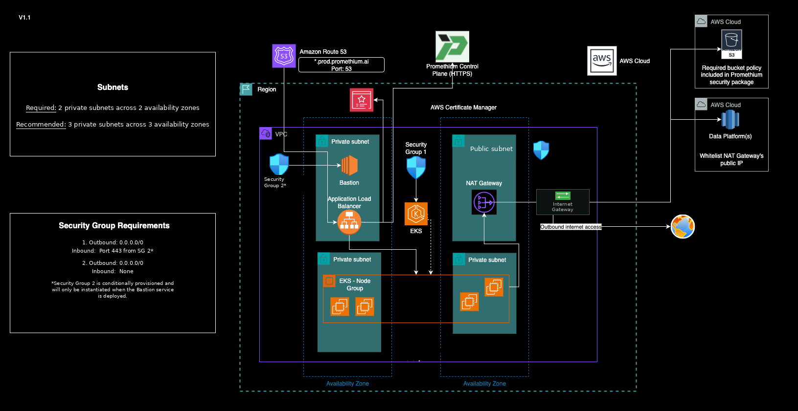

# Promethium Intelligent Edge AWS Installation (Customer)



This page documents instructions for the customer on how to install a secure Promethium Intelligent Edge (IE) on AWS. The full deployment is an Elastic Kubernetes Service (EKS) cluster within which the Promethium application services are deployed, fronted by an internal Application Load Balancer (ALB).

There are two documented ways to install — see [Install paths](#install-paths) below. **New installs should use the self-serve scripted install (Model A′ / argocd-agent)**; the original manual, CFT-by-CFT / on-call Terraform flow is kept further down as a clearly labeled reference.

- [Promethium Intelligent Edge AWS Installation (Customer)](#promethium-intelligent-edge-aws-installation-customer)
- [Install paths](#install-paths)
- [Quick start (scripted A′)](#quick-start-scripted-a)
- [Prerequisites](#prerequisites)
    - [Environment Prerequisites](#environment-prerequisites)
    - [VPC and Subnet Requirements](#vpc-and-subnet-requirements)
    - [Example layout for a `10.0.0.0/22` VPC (recommended — 3 private subnets + 1 public)](#example-layout-for-a-1000022-vpc-recommended--3-private-subnets--1-public)
    - [Required subnet tags](#required-subnet-tags)
    - [Networking Requirements](#networking-requirements)
      - [Install VM - Outbound Access](#install-vm---outbound-access)
      - [EKS Nodes - Outbound Access](#eks-nodes---outbound-access)
- [Customer Information Required by Promethium](#customer-information-required-by-promethium)
  - [AWS Environment](#aws-environment)
  - [VPC and Subnets](#vpc-and-subnets)
  - [Install VM](#install-vm)
  - [Provided by Promethium](#provided-by-promethium)
- [Reference: manual (non-agent) install](#reference-manual-non-agent-install)
  - [1. IAM Install Roles](#1-iam-install-roles)
  - [2. VPC subnet](#2-vpc-subnet)
    - [2.a Option A — Create VPC with Promethium Network CFT](#2a-option-a--create-vpc-with-promethium-network-cft)
      - [What it creates](#what-it-creates)
      - [Deploy the network stack](#deploy-the-network-stack)
    - [2.b Option B — Tag Your Existing Subnets](#2b-option-b--tag-your-existing-subnets)
  - [3. Jumpbox](#3-jumpbox)
    - [3.a Option A — Create Jumpbox with Promethium Jumpbox CFT](#3a-option-a--create-jumpbox-with-promethium-jumpbox-cft)
      - [Required inputs (from previous stack outputs)](#required-inputs-from-previous-stack-outputs)
      - [Deploy the jumpbox stack](#deploy-the-jumpbox-stack)
    - [3.b Option B - Attach the instance profile to your provided install VM](#3b-option-b---attach-the-instance-profile-to-your-provided-install-vm)
  - [4. Operational Roles](#4-operational-roles)
  - [5. Verification](#5-verification)
    - [5.1 Verifier Permissions (required before running verifier scripts)](#51-verifier-permissions-required-before-running-verifier-scripts)
    - [5.2 Verifier Script](#52-verifier-script)
- [Resources](#resources)

---

# Install paths

Promethium IE on AWS can be installed two ways:

- **Recommended — self-serve scripted install (Model A′ / argocd-agent).**
  Two wrapper scripts collapse the customer-account install to two commands
  (plus a 3-part agent enrollment), and teardown to one. The spoke
  `argocd-agent` dials **out** to the Promethium hub — Promethium never holds
  a credential to your cluster, and nothing is exposed inbound. Start with
  [Quick start](#quick-start-scripted-a) below, then go as deep as you need:
  - [AWS/scripts/README.md](scripts/README.md) — the wrapper scripts
    (`prereqs.sh` / `deploy.sh` / `destroy.sh`) in full detail
  - [AWS/runbook-agent-mode.md](runbook-agent-mode.md) — the full runbook:
    accounts/topology, prerequisites, install, the 3-part agent enrollment,
    validation, teardown, and troubleshooting
  - [AWS/agent/README.md](agent/README.md) — the spoke agent installer
    (`install-agent.sh`) used during agent enrollment
- **Reference — manual (non-agent) install.** The original CFT-by-CFT /
  hand-run Terraform flow, kept below at
  [Reference: manual (non-agent) install](#reference-manual-non-agent-install)
  for customers/paths not yet on Model A′. The scripted flow above supersedes
  it for new installs.

Both paths share the same customer-side environment/network prerequisites —
see [Prerequisites](#prerequisites) below.

---

# Quick start (scripted A′)

On a jumpbox (or an equivalent host) with your AWS account's credentials
active, and — once the cluster exists — private network reach to its API:

```bash
# 1. CloudFormation prerequisites (once per company) — deploys network.yaml
#    (skipped for BYO VPC), foundation.yaml, operational_roles.yaml, and
#    jumpbox.yaml, all locally (no S3 bucket) and idempotently.
./AWS/scripts/prereqs.sh <company> <env> [--vpc-id vpc-xxxx --subnet-ids subnet-a,subnet-b,subnet-c]

# 2. Everything else: EKS cluster + infra + tenant registration, then
#    (unless --skip-agent) agent enrollment.
./AWS/scripts/deploy.sh <company> <env>
```

`<company>` is lowercase `[a-z0-9-]`, 15 characters or fewer. `<env>` is one
of `dev` / `qa` / `preview` / `prod`. Installs default to a **private cluster
+ internal ALB** (VPN/in-VPC access only) — internet-facing is only for
internal Promethium public-cluster deployments.

Who runs what:

| Step | Who |
|---|---|
| One-time per customer AWS account: cross-account grants (ECR pull, hub saas-role trust) | Promethium |
| `prereqs.sh` (network / foundation / operational-roles / jumpbox CFTs) | Customer |
| `deploy.sh` (cluster, infra, tenant registration) | Customer |
| Agent enrollment: issue the mTLS cert + register it on the hub | Promethium |
| Agent enrollment: deliver the cert bundle (out-of-band, via the customer's own tfstate S3 bucket) | Promethium → Customer |
| Agent enrollment: install the agent on your cluster (`install-agent.sh`, called by `deploy.sh` unless `--skip-agent`) | Customer |
| Validate (`kubectl -n intelligentedge get pods`, in-VPC) | Customer |

Pass `deploy.sh --skip-agent` to stop after infrastructure if you'd rather run
the 3-part agent enrollment separately. Teardown is one command,
`./AWS/scripts/destroy.sh <company> <env>` — run it from a separate host,
never from the jumpbox being torn down.

See [AWS/scripts/README.md](scripts/README.md) for the full flag list and a
step-by-step account of what each script does, and
[AWS/runbook-agent-mode.md](runbook-agent-mode.md) for the complete runbook,
including validation and troubleshooting.

---

# Prerequisites

These apply to **both** install paths above.

### Environment Prerequisites

| Item | Description |
|------|-------------|
| AWS Account | The AWS account where the Promethium Intelligent Edge will be deployed |
| Region | AWS region for deployment (e.g., `eu-central-1`) |
| Install VM/jumpbox | An EC2 instance with an attached Security Group |
| VPC | An existing VPC of at least `/22` CIDR |
| Private Subnets | Minimum 2 private subnets across 2 availability zones (recommended: 3) — for EKS worker nodes and internal ALB |
| Outbound Internet Access | The install VM and EKS nodes require outbound HTTPS access via NAT Gateway |
| Company Name | A `${COMPANY_NAME}` variable used throughout the deployment — max 15 characters, lowercase, no spaces |
| GitHub PAT | A GitHub Personal Access Token with `read:packages` scope (provided by Promethium) |
| Promethium Image Tag | Application release version (e.g., `24.6.0`) — provided by Promethium |

### VPC and Subnet Requirements

Your VPC must be at least a `/22` CIDR (e.g., `10.0.0.0/22`). Promethium uses an **internal load balancer** — only private subnets are required for the application and ALB. EKS nodes do require outbound internet access (e.g. via NAT Gateway), but how that egress is provided is up to you.

| Configuration | Private Subnets | AZs | Routing | Required Tags |
|---|---|---|---|---|
| **Required (minimum)** | 2 | 2 different AZs | NAT Gateway | `kubernetes.io/role/internal-elb=1` |
| **Recommended** | 3 | 3 different AZs | NAT Gateway | `kubernetes.io/role/internal-elb=1` |

> ⚠️ **Minimum 2 private subnets across 2 availability zones are required.** The internal ALB and EKS node groups both use these subnets. More subnets across more AZs improve availability and provide additional IP space for nodes.

> ⚠️ **EKS worker nodes must be placed in private subnets only.** Public subnets auto-assign public IPs to instances, which causes EKS node group creation to fail.

> ℹ️ **Public subnets must not have kubernetes tags.** If your VPC has public subnets, ensure they have no `kubernetes.io/*` tags to avoid unintended ALB subnet discovery.

### Example layout for a `10.0.0.0/22` VPC (recommended — 3 private subnets + 1 public)

| Subnet | CIDR | AZ | Type | Purpose |
|---|---|---|---|---|
| subnet-1 | `10.0.0.0/24` | `us-east-1a` | Private | EKS worker nodes + internal ALB |
| subnet-2 | `10.0.1.0/24` | `us-east-1b` | Private | EKS worker nodes + internal ALB |
| subnet-3 | `10.0.2.0/24` | `us-east-1c` | Private | EKS worker nodes + internal ALB |
| subnet-4 | `10.0.3.0/24` | `us-east-1a` | Public | NAT Gateway |

### Required subnet tags

All private subnets must be tagged with the EKS cluster name **before** running Terraform:

| Subnet type | Tag Key | Tag Value |
|---|---|---|
| Private | `kubernetes.io/role/internal-elb` | `1` |
| Private | `kubernetes.io/cluster/<cluster_name>` | `owned` |

Where `<cluster_name>` = `promethium-datafabric-<environment>-<company_name>-eks-cluster` (e.g. `prod` if the customer did not already have a cluster with a custom name).

### Networking Requirements

#### Install VM - Outbound Access

| Endpoint | Purpose |
|----------|---------|
| `github.com`, `*.githubusercontent.com` | Clone Terraform wrapper repo |
| `ghcr.io` | Pull Helm charts |
| `releases.hashicorp.com` | Download Terraform binary |
| `registry.terraform.io` | Terraform provider and module downloads |
| `dl.k8s.io` | Download kubectl |
| `*.amazonaws.com` | AWS API endpoints (EKS, EC2, IAM, S3, ACM, Route 53) |
| `sts.amazonaws.com` | AWS STS assume-role |

#### EKS Nodes - Outbound Access

| Endpoint | Port | Purpose |
|----------|------|---------|
| `*.eks.amazonaws.com` | 443 | EKS API server communication |
| `*.ecr.*.amazonaws.com` | 443 | Promethium container images (AWS ECR) |
| `sts.amazonaws.com` | 443 | AWS STS for ECR token refresh |
| `ghcr.io` | 443 | Promethium Helm charts |
| `s3.amazonaws.com`, `*.s3.amazonaws.com` | 443 | S3 access for EKS and application data |

---

# Customer Information Required by Promethium

> **Which path needs this:** the manual (non-agent) path's associate-driven
> pre-call ([aws-install-pre-call.md](aws-install-pre-call.md)) uses the
> generated file below directly. On the **scripted path**, `deploy.sh` reads
> the equivalent values straight from the `foundation.yaml` /
> `operational_roles.yaml` / `network.yaml` / `jumpbox.yaml` stack outputs —
> you don't need to generate or send this file. The underlying facts (account
> ID, region, company name, image tag, and — for BYO VPC — your VPC/subnet
> IDs) are still what Promethium needs to know about your environment either
> way.

Run the following command to collect all outputs from CFT Stacks you created so far into a file: `promethium-outputs-${COMPANY_NAME}.sh`. If you opted to provide your own IAC instead of using provided CFTs for at least one of VPC or Install VM / Jumpbox, the corresponding variable in `promethium-outputs-${COMPANY_NAME}.sh` will be an empty string, and you must supply the value yourself by editing the file after it is created.

```bash
{
  get_output() { aws cloudformation describe-stacks --stack-name "$1" --query "Stacks[0].Outputs[?OutputKey==\`$2\`].OutputValue" --output text --region ${AWS_REGION} 2>/dev/null; }
  INSTALL_STACK="promethium-install-role-${COMPANY_NAME}"
  NETWORK_STACK="pmie-network-${COMPANY_NAME}"
  JUMPBOX_STACK="pmie-jumpbox-${COMPANY_NAME}"
  ROLES_STACK="promethium-eks-base-roles-${COMPANY_NAME}"
  echo "export COMPANY_NAME=\"${COMPANY_NAME}\""
  echo "export AWS_REGION=\"${AWS_REGION}\""
  echo "export CUSTOMER_ACCOUNT_ID=\"$(aws sts get-caller-identity --query Account --output text --region ${AWS_REGION})\""
  echo "export TERRAFORM_ASSUME_ROLE_ARN=\"$(get_output $INSTALL_STACK RoleArn)\""
  echo "export INSTANCE_PROFILE_NAME=\"$(get_output $INSTALL_STACK InstanceProfileName)\""
  echo "export VPC_ID=\"$(get_output $NETWORK_STACK VpcId)\""
  echo "export VPC_CIDR=\"$(get_output $NETWORK_STACK VpcCidrBlock)\""
  echo "export SUBNET1_ID=\"$(get_output $NETWORK_STACK Subnet1Id)\""
  echo "export SUBNET2_ID=\"$(get_output $NETWORK_STACK Subnet2Id)\""
  echo "export SUBNET3_ID=\"$(get_output $NETWORK_STACK Subnet3Id)\""
  echo "export JUMPBOX_INSTANCE_ID=\"$(get_output $JUMPBOX_STACK JumpboxInstanceId)\""
  echo "export JUMPBOX_SG_ID=\"$(get_output $JUMPBOX_STACK JumpboxSecurityGroupId)\""
  echo "export EKS_CLUSTER_ROLE_ARN=\"$(get_output $ROLES_STACK EKSClusterRoleArn)\""
  echo "export EKS_WORKER_ROLE_ARN=\"$(get_output $ROLES_STACK EKSWorkerNodeRoleArn)\""
  echo "export EBS_CSI_ROLE_ARN=\"$(get_output $ROLES_STACK EBSCSIDriverRoleArn)\""
  echo "export EFS_CSI_ROLE_ARN=\"$(get_output $ROLES_STACK EFSCSIDriverRoleArn)\""
  echo "export LB_CONTROLLER_ROLE_ARN=\"$(get_output $ROLES_STACK LoadBalancerControllerRoleArn)\""
  echo "export AUTOSCALER_ROLE_ARN=\"$(get_output $ROLES_STACK ClusterAutoscalerRoleArn)\""
  echo "export PG_BACKUP_ROLE_ARN=\"$(get_output $ROLES_STACK PGBackupServiceRoleArn)\""
  echo "export TRINO_ROLE_ARN=\"$(get_output $ROLES_STACK GlueTrinoServiceRoleArn)\""
} | tee promethium-outputs-${COMPANY_NAME}.sh
```

The following sections describe the outputs collected above.

### AWS Environment

| # | Item | Where to find it |
|---|------|-----------------|
| 1 | AWS Account ID | Console → top-right menu |
| 2 | AWS Region | Console → top navigation bar |
| 3 | Agreed `company_name` | Agreed with Promethium representative |

### VPC and Subnets

**AWS Console → VPC → Your VPCs** → note VPC ID and CIDR

**AWS Console → VPC → Subnets** → filter by VPC → find subnets routing via NAT Gateway

| # | Item |
|---|------|
| 4 | VPC ID |
| 5 | VPC CIDR block |
| 6 | Private Subnet IDs (2 minimum, in different AZs) |

### Install VM

**AWS Console → EC2 → Instances** → find jumpbox

| # | Item |
|---|------|
| 7 | Jumpbox Instance ID (`i-xxx`) |
| 8 | Jumpbox Security Group ID (`sg-xxx`) |

### Provided by Promethium

| Item | Description |
|------|-------------|
| `promethium_image_tag` | Application version to deploy |
| `company_name` | Agreed jointly with your Promethium representative |
| GitHub PAT | Personal Access Token for private Terraform modules |
| GHCR Token | Token for pulling Helm charts |

---

# Reference: manual (non-agent) install

> **Superseded by the [scripted A′ flow](#quick-start-scripted-a) above for
> new installs.** Kept here as a reference for customers/paths not yet on
> Model A′ — it predates `argocd-agent`: the customer hand-creates each IAM
> role CFT-by-CFT, a Promethium associate hand-creates and configures the
> customer's Terraform branch before the call
> ([aws-install-pre-call.md](aws-install-pre-call.md)), and the customer runs
> Terraform directly, on-call with the associate
> ([aws-install.md](aws-install.md)).

Installing this way involves two parties across three sequential steps:
- The customer first provides prerequisite AWS infrastructure (below) — VPC, subnets, install VM, install role, and operational IAM roles, etc.
- The Promethium associate then completes pre-call setup — creating and configuring the customer's Terraform branch ([aws-install-pre-call.md](aws-install-pre-call.md)).
- The customer then deploys the EKS cluster with Terraform, configures OIDC trust policies, and installs the full Promethium application stack — on-call with the Promethium associate ([aws-install.md](aws-install.md)).

Promethium is always deployed with an **internal load balancer** — accessible via VPN only.

Install jq (a JSON manipulation tool):
```bash
# for linux users
sudo apt install jq

# for macos users
brew install jq
```

Set your company name and the region in your AWS account for the install:
```bash
export COMPANY_NAME="..."
export AWS_REGION="..."
```
> NOTE: Instructions assume you are using linux/MacOS machine

## 1. IAM Install Roles


Deploy [`CFT/install_role.yaml`](CFT/install_role.yaml). This creates:

| Role | Used By | Purpose |
|------|---------|---------|
| `PromethiumDeploymentRole` | Install VM (jumpbox) | Terraform deployment role — attached to the install VM as an EC2 instance profile. Used to create and configure all Promethium infrastructure |

> The role is created as an **EC2 Instance Profile** and attached directly to the install VM. No access keys are needed.

Create the IAM role and EC2 instance profile that Terraform uses to provision infrastructure.

```bash
aws cloudformation create-stack --stack-name promethium-install-role-${COMPANY_NAME} --template-body file://AWS/CFT/install_role.yaml --parameters ParameterKey=PromethiumInstallRole,ParameterValue=PromethiumDeploymentRole-${COMPANY_NAME} --capabilities CAPABILITY_NAMED_IAM --region ${AWS_REGION}
```

Wait for the stack to complete successfully, then run the following command in your AWS-authenticated terminal to allow the role to assume itself (allowing terraform on EC2 to chain credential sessions):
```bash
STACK_NAME="promethium-install-role-${COMPANY_NAME}"
ROLE_ARN=$(aws cloudformation describe-stacks --stack-name "$STACK_NAME" --query 'Stacks[0].Outputs[?OutputKey==`RoleArn`].OutputValue' --output text)
ROLE_NAME="${ROLE_ARN##*/}"
ACCOUNT_ID=$(aws sts get-caller-identity --query Account --output text)
CURRENT_POLICY=$(aws iam get-role --role-name "$ROLE_NAME" --query 'Role.AssumeRolePolicyDocument' --output json)

NEW_POLICY=$(echo "$CURRENT_POLICY" | jq --arg arn "$ROLE_ARN" '.Statement += [{"Effect":"Allow","Principal":{"AWS":$arn},"Action":"sts:AssumeRole"}]')

aws iam update-assume-role-policy --role-name "$ROLE_NAME" --policy-document "$NEW_POLICY"
```

## 2. VPC subnet

- If you don't yet have a VPC with subnets, follow **2.a** and skip **2.b**. 
- If you already have a VPC with subnets, follow **2.b** and skip **2.a**.

### 2.a Option A — Create VPC with Promethium Network CFT

If you do not have an existing VPC, Promethium provides a CloudFormation template (CFT) that creates all required networking resources.

The template is located at [`AWS/CFT/network.yaml`](CFT/network.yaml) in this repository.

#### What it creates

- VPC with configurable CIDR
- 3 private subnets — for EKS nodes (outbound routed via NAT Gateway)
- 1 public subnet — hosts NAT Gateway
- Internet Gateway and NAT Gateway
- Route tables and associations

> This CFT tags the private subnets for internal ALB use only. The public subnet exists solely to host the NAT Gateway, which provides outbound internet access for EKS nodes — no application traffic is exposed to the public internet.

#### Deploy the network stack

> `Environment` and `CompanyName` are required parameters (no default) — both must be supplied.

```bash
aws cloudformation create-stack --stack-name pmie-network-${COMPANY_NAME} --template-body file://AWS/CFT/network.yaml --parameters ParameterKey=Environment,ParameterValue=prod ParameterKey=CompanyName,ParameterValue=${COMPANY_NAME} ParameterKey=VpcName,ParameterValue=${COMPANY_NAME}-vpc ParameterKey=VpcCidrBlock,ParameterValue=10.0.0.0/22 ParameterKey=EksClusterName,ParameterValue=promethium-datafabric-prod-${COMPANY_NAME}-eks-cluster --region ${AWS_REGION}
```

---

### 2.b Option B — Tag Your Existing Subnets

If you are bringing your own VPC, apply the required EKS tags using the tagging utility:

```bash
cd AWS
./utilities/tag_subnets.sh <vpc_id> ${AWS_REGION} ${COMPANY_NAME}
```

Or apply them manually:

```bash
CLUSTER_NAME="promethium-datafabric-prod-${COMPANY_NAME}-eks-cluster"
REGION="${AWS_REGION}"

PRIVATE_SUBNET_IDS="<subnet-id-1> <subnet-id-2> <subnet-id-3>"  # Fill in: your private subnet IDs
# Private subnets (EKS nodes)
for SUBNET_ID in ${PRIVATE_SUBNET_IDS}; do
  aws ec2 create-tags --resources $SUBNET_ID --region $REGION --tags Key="kubernetes.io/cluster/${CLUSTER_NAME}",Value=owned Key="kubernetes.io/role/internal-elb",Value=1
done
```

Then, note the following variables from your self-provided VPC:

**Outputs to record:**

| Output Key | Used In |
|---|---|
| `VpcId` | `vpc_info.vpc_id` in tfvars; required input for jumpbox stack |
| `VpcCidrBlock` | `vpc_info.vpc_cidr` in tfvars |
| `Subnet1Id` | `vpc_info.subnet_ids` (private); required input for jumpbox stack |
| `Subnet2Id` | `vpc_info.subnet_ids` (private) |
| `Subnet3Id` | `vpc_info.subnet_ids` (private) |


---

## 3. Jumpbox

- If you don't yet have an install VM, follow **3.a** (skip **3.b**) to create one with the Promethium jumpbox CFT.
- If you already have an install VM, follow **3.b** (skip **3.a**) to attach the instance profile to it.

### 3.a Option A — Create Jumpbox with Promethium Jumpbox CFT

The template is located at [`AWS/CFT/jumpbox.yaml`](CFT/jumpbox.yaml).

#### Required inputs (from previous stack outputs)

| Parameter | Value | Source |
|---|---|---|
| `VpcId` | VPC ID | `pmie-network-${COMPANY_NAME}` output `VpcId`, or your existing VPC ID |
| `PrivateSubnet1Id` | Private Subnet 1 ID (AZ-a) | `pmie-network-${COMPANY_NAME}` output `Subnet1Id`, or your existing private subnet ID |

#### Deploy the jumpbox stack

> NOTE: if you provided your own VPC (option 2.b), set `VPC_ID="<your-vpc-id>"` and `SUBNET1_ID="<your-private-subnet-id>"` from the values you noted in section 2.b (`VpcId` and `Subnet1Id`). `Environment` is also a required parameter (no default).

```bash
# If using Promethium network CFT (Option 2.a):
VPC_ID=$(aws cloudformation describe-stacks --stack-name "pmie-network-${COMPANY_NAME}" --query 'Stacks[0].Outputs[?OutputKey==`VpcId`].OutputValue' --output text --region ${AWS_REGION})
SUBNET1_ID=$(aws cloudformation describe-stacks --stack-name "pmie-network-${COMPANY_NAME}" --query 'Stacks[0].Outputs[?OutputKey==`Subnet1Id`].OutputValue' --output text --region ${AWS_REGION})

# If using your own VPC (Option 2.b), set these manually and uncomment them instead of above:

# VPC_ID="<your-vpc-id>"
# SUBNET1_ID="<your-private-subnet-id>"

aws cloudformation create-stack --stack-name pmie-jumpbox-${COMPANY_NAME} --template-body file://AWS/CFT/jumpbox.yaml --parameters ParameterKey=Environment,ParameterValue=prod ParameterKey=VpcId,ParameterValue=${VPC_ID} ParameterKey=PrivateSubnet1Id,ParameterValue=${SUBNET1_ID} ParameterKey=JumpboxName,ParameterValue=${COMPANY_NAME}-jumpbox ParameterKey=UseExistingInstanceProfile,ParameterValue=PromethiumDeploymentRole-${COMPANY_NAME}InstanceProfile --region ${AWS_REGION}
```

> ℹ️ Deploy the install role (Section 1) **before** this stack to attach the instance profile automatically via `UseExistingInstanceProfile`.

### 3.b Option B - Attach the instance profile to your provided install VM

```bash
INSTALL_VM_INSTANCE_ID="<your-ec2-instance-id>"  # Fill in: your existing EC2 instance ID
INSTANCE_PROFILE_NAME=$(aws cloudformation describe-stacks --stack-name "promethium-install-role-${COMPANY_NAME}" --query 'Stacks[0].Outputs[?OutputKey==`InstanceProfileName`].OutputValue' --output text --region ${AWS_REGION})
aws ec2 associate-iam-instance-profile --instance-id ${INSTALL_VM_INSTANCE_ID} --iam-instance-profile Name=${INSTANCE_PROFILE_NAME} --region ${AWS_REGION}
```

Record the following variables for your self-provided jumpbox / install VM.

| Output Key | Used In |
|---|---|
| `JumpboxInstanceId` | Install VM instance ID |
| `JumpboxSecurityGroupId` | `jumpbox_sg_id` in tfvars |


---

## 4. Operational Roles

Deploy [`CFT/operational_roles.yaml`](CFT/operational_roles.yaml).

> `OIDCProviderUrl` is left as the default dummy value — it is updated after Phase 1a once the EKS cluster and OIDC provider exist. `Environment` and `CompanyName` are both required parameters (no default).

Use this when the EKS cluster will be created by the Promethium Terraform deployment. The cluster name defaults to `promethium-datafabric-prod-${COMPANY_NAME}-eks-cluster`.

```bash
aws cloudformation create-stack --stack-name promethium-eks-base-roles-${COMPANY_NAME} --template-body file://AWS/CFT/operational_roles.yaml --parameters ParameterKey=CompanyName,ParameterValue=${COMPANY_NAME} ParameterKey=Environment,ParameterValue=prod --capabilities CAPABILITY_NAMED_IAM --region ${AWS_REGION}
```

---

This creates all 9 operational roles (all default names follow `promethium-<environment>-${COMPANY_NAME}-<role>`):

| Role | Used By | Purpose |
|------|---------|---------|
| `promethium-prod-${COMPANY_NAME}-eks-cluster-role` | EKS control plane | Gives the EKS control plane permissions to run the cluster, manage AWS infrastructure, and manage pod-level networking |
| `promethium-prod-${COMPANY_NAME}-eks-worker-role` | EKS worker nodes | Allows nodes to pull container images from ECR, manage EFS volumes via CSI driver, and handle network management within EKS |
| `promethium-prod-${COMPANY_NAME}-ebs-csi-driver-role` | EBS CSI driver | Allows the EBS CSI driver to provision, attach, delete, and snapshot encrypted EBS volumes using KMS keys |
| `promethium-prod-${COMPANY_NAME}-efs-csi-driver-role` | EFS CSI driver | Allows the EFS CSI driver to provision and manage EFS file systems and access points |
| `promethium-prod-${COMPANY_NAME}-lb-controller-role` | Load Balancer Controller | Allows the LB Controller to provision and manage ALBs/NLBs on behalf of Kubernetes ingress and service resources |
| `promethium-prod-${COMPANY_NAME}-cluster-autoscaler-role` | Cluster Autoscaler | Allows the autoscaler to add or remove worker nodes in Auto Scaling Groups based on cluster demand |
| `promethium-prod-${COMPANY_NAME}-pg-backup-role` | Postgres backup | Allows postgres backups to be written to S3 and container images to be pulled from ECR |
| `promethium-prod-${COMPANY_NAME}-trino-oidc-role` | Trino / Glue crawlers | Allows Trino to query and manage data in Glue Data Catalog and S3, handle KMS-encrypted data, and interact with Glue jobs |
| `promethium-prod-${COMPANY_NAME}-argocd-ecr-refresher` | `argocd-ecr-cred-refresher` CronJob | Mints a short-lived ECR token so the cluster can pull the Promethium OCI umbrella chart / images — used by the agent (OCI) install path |

**Outputs:**

| Output Key | Used In |
|---|---|
| `EKSClusterRoleArn` | `cluster_role_arn` in tfvars |
| `EKSWorkerNodeRoleArn` | `worker_role_arn` in tfvars |
| `EBSCSIDriverRoleArn` | `aws_ebs_driver_role_arn` in tfvars |
| `EFSCSIDriverRoleArn` | `aws_efs_driver_role_arn` in tfvars |
| `LoadBalancerControllerRoleArn` | `aws_lb_controller_role_arn` in tfvars |
| `ClusterAutoscalerRoleArn` | `aws_eks_autoscaler_role_arn` in tfvars |
| `PGBackupServiceRoleArn` | `pg_backup_cronjob_oidc_role_arn` in tfvars |
| `GlueTrinoServiceRoleArn` | `trino_oidc_role_arn` in tfvars |
| `ArgocdEcrRefresherRoleArn` | `ECR_REFRESHER_ROLE_ARN` (agent enrollment) |

---

## 5. Verification

### 5.1 Verifier Permissions (required before running verifier scripts)

Add the necessary read-only permissions to your own AWS user/role in order to run verification scripts:

```json
cat > verifier-permissions.json << 'EOF'
{
  "Version": "2012-10-17",
  "Statement": [
    {
      "Sid": "STSReadOnly",
      "Effect": "Allow",
      "Action": [
        "sts:GetCallerIdentity"
      ],
      "Resource": "*"
    },
    {
      "Sid": "IAMReadOnly",
      "Effect": "Allow",
      "Action": [
        "iam:GetRole",
        "iam:ListRolePolicies",
        "iam:GetRolePolicy",
        "iam:ListAttachedRolePolicies",
        "iam:ListInstanceProfilesForRole",
        "iam:ListRoles"
      ],
      "Resource": "*"
    },
    {
      "Sid": "EC2ReadOnly",
      "Effect": "Allow",
      "Action": [
        "ec2:DescribeVpcs",
        "ec2:DescribeVpcAttribute",
        "ec2:DescribeSubnets",
        "ec2:DescribeRouteTables",
        "ec2:DescribeTags",
        "ec2:DescribeNatGateways",
        "ec2:DescribeInternetGateways"
      ],
      "Resource": "*"
    },
    {
      "Sid": "CloudFormationReadOnly",
      "Effect": "Allow",
      "Action": [
        "cloudformation:DescribeStacks"
      ],
      "Resource": "*"
    },
    {
      "Sid": "EKSReadOnly",
      "Effect": "Allow",
      "Action": [
        "eks:DescribeCluster"
      ],
      "Resource": "*"
    }
  ]
}
EOF
```

> **Notes:**
> - This policy grants read-only access to CloudFormation, IAM, and EKS used only by the verifier scripts. It can be removed after the install is complete.
> - All permissions are read-only — the verification scripts make no changes to your AWS environment.
> - `iam:ListRoles` is only used by `verify_operational_roles.sh --discover` mode. It can be omitted if `--discover` won't be used.
> - All EC2 Describe actions require `Resource: "*"` — AWS does not support resource-level restrictions on these.
> - `verify_install_role.sh` includes a cross-account trust test (section 5b) that attempts to assume `PromethiumDeploymentRole`. This test is only valid when run from the jumpbox with the instance profile attached — from a local terminal it will automatically skip with a warning. No `sts:AssumeRole` permission is needed.

**If you are using an IAM role**:

```bash
CUSTOMER_ROLE_NAME="<your-iam-role-name>"  # Fill in: your IAM role name
aws iam put-role-policy \
  --role-name ${CUSTOMER_ROLE_NAME} \
  --policy-name promethium-verifier-policy \
  --policy-document file://verifier-permissions.json \
  --region ${AWS_REGION}
```

**If you are using an IAM user**:

```bash
CUSTOMER_USER_NAME="<your-iam-user-name>"  # Fill in: your IAM user name
aws iam put-user-policy \
  --user-name ${CUSTOMER_USER_NAME} \
  --policy-name promethium-verifier-policy \
  --policy-document file://verifier-permissions.json \
  --region ${AWS_REGION}
```

Where `verifier-permissions.json` is the policy JSON saved to a local file.

---

### 5.2 Verifier Script

```bash
curl -fsSL -O https://raw.githubusercontent.com/promethium-ai/promethium-install-public/main/AWS/utilities/verify_install_role.sh
chmod +x verify_install_role.sh
./verify_install_role.sh PromethiumDeploymentRole-${COMPANY_NAME} ${AWS_REGION}

curl -fsSL -O https://raw.githubusercontent.com/promethium-ai/promethium-install-public/main/AWS/utilities/verify_network.sh
chmod +x verify_network.sh
# From Promethium network CFT (Option A):
VPC_ID=$(aws cloudformation describe-stacks --stack-name "pmie-network-${COMPANY_NAME}" --query 'Stacks[0].Outputs[?OutputKey==`VpcId`].OutputValue' --output text --region ${AWS_REGION})
# If using your own VPC (Option B), set manually instead:
# VPC_ID="<your-vpc-id>"
./verify_network.sh ${COMPANY_NAME} ${VPC_ID} ${AWS_REGION} --stack pmie-network-${COMPANY_NAME}

curl -fsSL -O https://raw.githubusercontent.com/promethium-ai/promethium-install-public/main/AWS/utilities/verify_operational_roles.sh
chmod +x verify_operational_roles.sh
./verify_operational_roles.sh ${COMPANY_NAME} ${AWS_REGION} promethium-eks-base-roles-${COMPANY_NAME}
```

Once verification is done, you may remove the trust policy:

If you are using an **IAM role**:
```bash
CUSTOMER_ROLE_NAME="<your-iam-role-name>"  # Fill in: your IAM role name
aws iam delete-role-policy --role-name ${CUSTOMER_ROLE_NAME} --policy-name promethium-verifier-policy
```

If you are using an **IAM user**:
```bash
CUSTOMER_USER_NAME="<your-iam-user-name>"  # Fill in: your IAM user name
aws iam delete-user-policy --user-name ${CUSTOMER_USER_NAME} --policy-name promethium-verifier-policy
```

---

# Resources

**Scripted A′ install:**

| Resource | Description |
|----------|-------------|
| [AWS/scripts/README.md](scripts/README.md) | The wrapper scripts (`prereqs.sh` / `deploy.sh` / `destroy.sh`) — full command/flag reference |
| [AWS/runbook-agent-mode.md](runbook-agent-mode.md) | The complete Model A′ runbook: accounts, prerequisites, install, agent enrollment, validation, teardown, troubleshooting |
| [AWS/agent/README.md](agent/README.md) | The spoke agent installer (`install-agent.sh`) |
| [CFT/README.md](CFT/README.md) | The CloudFormation templates `prereqs.sh` deploys (`network.yaml`, `foundation.yaml`, `operational_roles.yaml`, `jumpbox.yaml`) |

**Manual (non-agent) reference:**

| Resource | Description |
|----------|-------------|
| [AWS Install Guide (pre-call)](aws-install-pre-call.md) | Step-by-step installation guide for Promethium associates before installing on-call |
| [AWS Install Guide](aws-install.md) | Run by the customer on-call with a Promethium associate |
| [Install Role CFT](CFT/install_role.yaml) | Creates the Terraform deployment role and instance profile |
| [Verifier Policy CFT](CFT/verifier_policy.yaml) | Adds read-only permissions for running pre-install verifier scripts from the jumpbox |
| [Operational Roles CFT](CFT/operational_roles.yaml) | Creates EKS cluster role, worker role, and all OIDC/IRSA roles (same file the scripted flow deploys via `prereqs.sh`) |
| [S3 Private Crawler](CFT/s3-private-crawler/) | VPC gateway endpoint and Glue network connection for private S3 access |
| [Utilities](utilities/) | Helper scripts for tool installation, role verification, and diagnostics |

> For customers needing private S3 access for Trino and Glue crawlers, see the `CFT/s3-private-crawler` folder, which includes the deployment guidance and CloudFormation template for the gateway endpoint and Glue NETWORK connection.
