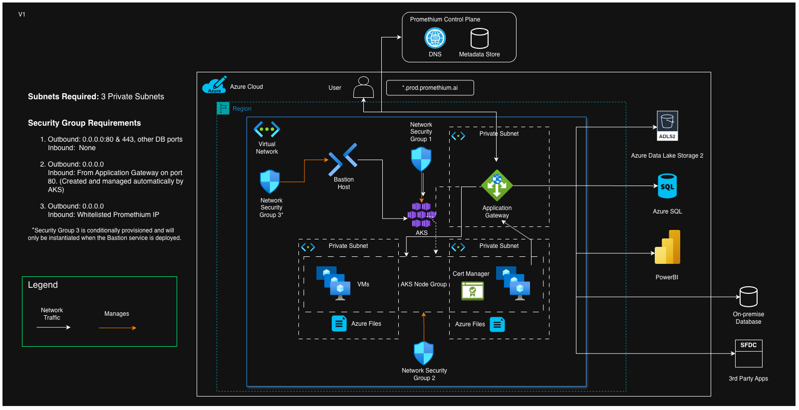

# ✅ Promethium Intelligent Edge Installation (Azure)

The following steps will describe how to deploy a secure Promethium Intelligent Edge in Azure. It will deploy an Azure Kubernetes Service (AKS) within which the Promethium Application services will be deployed. The deployment will configure the following footprint;

## 📋 1. Environment Prerequisites

| Item                    | Description                                                                 |
|-------------------------|-----------------------------------------------------------------------------|
| Azure Subscription      | Identify the AWS account where the data plane will be deployed              |
| Region                  | AWS region for deployment (e.g., `us-east-1`)                       |
| VNet                    | VPC ID that is at least /22 that will contain the Promethium Intelligent Edge |
| 3+ Private subnets      | Subnets (/24) that will support the kubernetes cluster |
| Outbound Internet Access| Ensure EKS nodes have HTTPS access to Promethium Control Plane + image registry |
| DNS & Ingress           | Allow cloud-native ingress (ALB) creation and domain assignment         |
| ADLS (Hierarchical)     | Storage location for state persistence and materialized Datamaps |
| Company Name            | This is a variable <company_name> that is used in a number of the scripts in this guide. Please liaise with your Promethium technical representative to agree on the value for this variable. |

---

## 🔐 2. Azure Roles & Privileges

The install process will assume an existing user’s access role which should have `contributor access` as well as permission to perform the following actions:
- Microsoft.Authorization/roleAssignments/read
- Microsoft.Authorization/roleAssignments/write
- Microsoft.Authorization/roleAssignments/delete
