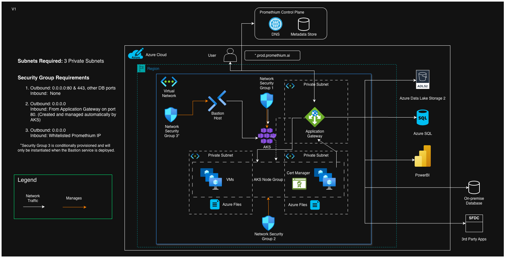

# Promethium Intelligent Edge Installation (Azure)



The following steps describe how to deploy a secure Promethium Intelligent Edge on Azure. It will deploy an Azure Kubernetes Service (AKS) cluster within which the Promethium application services are deployed, fronted by an Azure Application Gateway.

---

## 1. Environment Prerequisites

| Item | Description |
|------|-------------|
| Azure Subscription | The Azure subscription where the Promethium Intelligent Edge will be deployed |
| Region | Azure region for deployment (e.g., `eastus`, `centralus`) |
| VNet | An existing VNet of at least /22, or allow Terraform to create one |
| 3 Subnets | Three dedicated subnets — see subnet requirements below |
| Outbound Internet Access | The install VM and AKS nodes require outbound HTTPS access — see Networking Requirements below |
| Company Name | A `<company_name>` variable used throughout the deployment. Agree on this value with your Promethium technical representative before starting |
| GitHub PAT | A GitHub Personal Access Token with `read:packages` scope to pull private Terraform modules and Helm charts (provided by Promethium) |
| AWS Credentials | Access key and secret for the IAM user permitted to assume the Promethium ECR role (provided by Promethium) |

### Subnet Requirements

Three subnets are required, each in your VNet:

| Subnet Key | Purpose | Minimum Size |
|------------|---------|--------------|
| `aks_subnet` | AKS node pool | /24 |
| `appgw_subnet` | Azure Application Gateway (dedicated — Azure platform requirement) | /27 |
| `bastion_subnet` | Jumpbox / Bastion Host | /27 |

If you are not deploying a Jumpbox (`install_jumpbox = false`), the `bastion_subnet` still needs to exist but will remain unused.

> **Note:** If you allow Terraform to create the VNet (`install_vnet = true`), all three subnets are created automatically.

### Networking Requirements

#### Subnet Rules

The `appgw_subnet` **must** be dedicated exclusively to the Application Gateway. This is a hard Azure platform requirement — no other resources (VMs, NICs, etc.) may be placed in this subnet.

No specific NSG rules are required between the three subnets. Azure's default VNet routing allows intra-VNet communication. However, if your organisation applies custom NSGs to subnets, ensure the following traffic is permitted:

| From | To | Port | Protocol | Purpose |
|------|----|------|----------|---------|
| `aks_subnet` | `appgw_subnet` | 65200–65535 | TCP | Application Gateway health probes (Azure requirement) |
| `appgw_subnet` | `aks_subnet` | 80, 443 | TCP | Application Gateway → AKS ingress |
| `bastion_subnet` | Internet | 443 | TCP | Install VM outbound access |

#### Install VM — Outbound Access

The install VM must be able to reach the following endpoints over HTTPS (port 443) during deployment. If your network uses an allowlist-based firewall or NSG, add these:

| Endpoint | Purpose |
|----------|---------|
| `github.com`, `*.githubusercontent.com` | Clone Terraform wrapper repo, download tools |
| `ghcr.io` | Pull Helm charts from GitHub Container Registry |
| `releases.hashicorp.com` | Download Terraform binary |
| `registry.terraform.io` | Terraform provider and module downloads |
| `dl.k8s.io` | Download kubectl |
| `aka.ms`, `packages.microsoft.com` | Azure CLI installation |
| `awscli.amazonaws.com` | AWS CLI installation |
| `pypi.org`, `files.pythonhosted.org` | Python boto3 package (pip install) |
| `management.azure.com` | Azure Resource Manager API |
| `login.microsoftonline.com` | Azure AD authentication |
| `sts.amazonaws.com` | AWS STS assume-role |

#### AKS Nodes — Outbound Access

AKS nodes require outbound access for cluster operations and to pull Promethium container images. If you restrict egress at the subnet or firewall level, allow:

| Endpoint | Port | Purpose |
|----------|------|---------|
| `*.hcp.<region>.azmk8s.io` | 443 | AKS API server communication |
| `mcr.microsoft.com`, `*.data.mcr.microsoft.com` | 443 | Microsoft container images (CoreDNS, metrics-server, etc.) |
| `management.azure.com` | 443 | Azure API for Kubernetes operations |
| `login.microsoftonline.com` | 443 | Azure AD token refresh |
| `*.blob.core.windows.net` | 443 | AKS node image downloads, Azure Storage |
| `*.table.core.windows.net` | 443 | Azure Table Storage (AKS telemetry) |
| `*.vault.azure.net` | 443 | Azure Key Vault access |
| `ghcr.io` | 443 | Promethium Helm charts |
| `*.dkr.ecr.*.amazonaws.com` | 443 | Promethium container images (AWS ECR) |
| `api.ecr.*.amazonaws.com` | 443 | ECR authentication API |
| `sts.amazonaws.com` | 443 | AWS STS for ECR token refresh |

> **Note:** For a complete list of AKS-required endpoints, see [Microsoft's documentation on AKS outbound network rules](https://learn.microsoft.com/en-us/azure/aks/outbound-rules-control-egress).

#### DNS

If your VNet uses custom DNS servers (instead of Azure-provided DNS at 168.63.129.16), ensure they can resolve all endpoints listed above. Misconfigured DNS is a common cause of silent failures during `terraform init` and Helm chart pulls.

---

## 2. Azure Roles & Privileges

A Service Principal (SP) is used to run the Terraform deployment. It requires:

| Role | Scope | Purpose |
|------|-------|---------|
| Contributor | Resource Group | Create and manage all Azure resources |
| User Access Administrator | Resource Group | Create the 7 RBAC role assignments that allow AKS to manage the App Gateway, Key Vault, and Storage |

### Creating the Service Principal

```bash
az ad sp create-for-rbac \
  --name "<company_name>-promethium-sp" \
  --role Contributor \
  --scopes /subscriptions/<subscription_id>/resourceGroups/<resource_group_name>
```

### Granting User Access Administrator

This must be run by an Azure Owner whose role assignment has no ABAC conditions:

```bash
az role assignment create \
  --assignee <sp_client_id> \
  --role "User Access Administrator" \
  --scope /subscriptions/<subscription_id>/resourceGroups/<resource_group_name>
```

> **Note:** This step is blocked if the Owner role has ABAC conditions attached. In that case, ask another Owner without ABAC restrictions to run the command.

> **Tip:** If you plan to deploy to multiple resource groups (e.g., dev, staging, prod), scope both role assignments at the **subscription level** instead of the resource group level. This avoids having to re-grant roles each time a new resource group is created:
> ```bash
> az role assignment create \
>   --assignee <sp_client_id> \
>   --role "Contributor" \
>   --scope /subscriptions/<subscription_id>
>
> az role assignment create \
>   --assignee <sp_client_id> \
>   --role "User Access Administrator" \
>   --scope /subscriptions/<subscription_id>
> ```

---

## 3. Terraform State Backend

Terraform state should be stored in an Azure Storage Account. This can be in the Promethium subscription (managed by Promethium) or in the customer subscription. Create the backend resources:

```bash
# Create resource group for Terraform state
az group create --name <tf_state_rg> --location <region>

# Create storage account
az storage account create \
  --name <tf_state_storage_account> \
  --resource-group <tf_state_rg> \
  --location <region> \
  --sku Standard_LRS

# Create container
az storage container create \
  --name terraform-backend \
  --account-name <tf_state_storage_account>
```

---

## 4. Installation VM

Terraform must be run from a VM inside the customer VNet. The VM requires:

- Ubuntu 22.04 LTS (Python 3.10+) or Ubuntu 24.04 LTS (Python 3.12+)
- Public IP with NSG rule allowing inbound SSH (port 22) from your IP only
- Unrestricted outbound internet access on port 443 (see Networking Requirements above for specific endpoints)
- Placed in the `bastion_subnet` (or `application_subnet`)
- The following tools installed: `terraform`, `kubectl`, `helm`, `az`, `aws`, `git`, `python3-venv`

### Tool Installation

The versions below have been tested and validated. Update only when a new release has been verified.

```bash
sudo apt-get update

# Prerequisites
sudo apt-get install -y gnupg software-properties-common unzip git

# Terraform (pinned version)
TERRAFORM_VERSION="1.14.8"
wget -O- https://apt.releases.hashicorp.com/gpg | sudo gpg --dearmor -o /usr/share/keyrings/hashicorp-archive-keyring.gpg
echo "deb [signed-by=/usr/share/keyrings/hashicorp-archive-keyring.gpg] https://apt.releases.hashicorp.com $(lsb_release -cs) main" | sudo tee /etc/apt/sources.list.d/hashicorp.list
sudo apt-get update && sudo apt-get install -y terraform=${TERRAFORM_VERSION}-*

# kubectl (pinned version)
KUBECTL_VERSION="v1.35.3"
curl -LO "https://dl.k8s.io/release/${KUBECTL_VERSION}/bin/linux/amd64/kubectl"
sudo install -o root -g root -m 0755 kubectl /usr/local/bin/kubectl

# Helm (pinned version)
HELM_VERSION="v3.20.1"
curl https://raw.githubusercontent.com/helm/helm/main/scripts/get-helm-3 | bash -s -- --version ${HELM_VERSION}

# Azure CLI (pinned version)
AZ_VERSION="2.84.0"
sudo mkdir -p /etc/apt/keyrings
curl -sLS https://packages.microsoft.com/keys/microsoft.asc | gpg --dearmor | sudo tee /etc/apt/keyrings/microsoft.gpg > /dev/null
echo "deb [arch=amd64 signed-by=/etc/apt/keyrings/microsoft.gpg] https://packages.microsoft.com/repos/azure-cli/ $(lsb_release -cs) main" | sudo tee /etc/apt/sources.list.d/azure-cli.list
sudo apt-get update && sudo apt-get install -y azure-cli=${AZ_VERSION}-1~$(lsb_release -cs)

# AWS CLI v2 (do not use apt — it ships an outdated v1)
curl "https://awscli.amazonaws.com/awscli-exe-linux-x86_64.zip" -o "awscliv2.zip"
unzip -o awscliv2.zip && sudo ./aws/install

# Python venv (required by Terraform module scripts)
sudo apt-get install -y python3-venv python3-pip
mkdir -p /tmp/venv
python3 -m venv /tmp/venv/.venv
/tmp/venv/.venv/bin/pip install boto3
```

> **Note:** AWS CLI v2 does not support version pinning via the zip installer. It always installs the latest v2 release.

### Verify Tool Versions

Record the installed versions for compliance documentation:

```bash
terraform version
kubectl version --client
helm version --short
az version
aws --version
python3 --version
```

---

## 5. Customer Information Required

Before starting the deployment, provide the following to your Promethium technical representative.

### Azure Environment

| # | Item |
|---|------|
| 1 | Azure Subscription ID |
| 2 | Azure Tenant ID |
| 3 | Azure Region (e.g., `eastus`) |
| 4 | Resource Group name |

### VNet and Subnets

| # | Item |
|---|------|
| 5 | VNet name |
| 6 | VNet resource group (if different from #4) |
| 7a | AKS subnet name (min /24) |
| 7b | App Gateway subnet name (min /27, dedicated) |
| 7c | Bastion / application subnet name (min /27) |
| 8a | AKS subnet address range (e.g., `10.14.0.0/24`) |
| 8b | App Gateway subnet address range (e.g., `10.14.1.0/27`) |
| 8c | Bastion subnet address range (e.g., `10.14.2.0/27`) |

### Networking

| # | Item |
|---|------|
| 9 | Free static IP within the App Gateway subnet (e.g., `10.14.1.10`) |
| 10 | VNet address space (e.g., `10.14.0.0/22`) |

### Terraform State Backend

| # | Item |
|---|------|
| 11 | Storage account name |
| 12 | Storage account resource group |
| 13 | Container name (recommended: `terraform-backend`) |

### Service Principal

Create the SP and set credentials as environment variables on your install VM. The secret does not need to be shared with Promethium.

```bash
# Create the SP (save the output — the secret is only shown once)
az ad sp create-for-rbac \
  --name "<company_name>-promethium-sp" \
  --role Contributor \
  --scopes /subscriptions/<subscription_id>/resourceGroups/<rg_name>

# Grant User Access Administrator (must be run by an Owner without ABAC conditions)
az role assignment create \
  --assignee <appId_from_above> \
  --role "User Access Administrator" \
  --scope /subscriptions/<subscription_id>/resourceGroups/<rg_name>
```

Then on your install VM:

```bash
export ARM_CLIENT_ID="<appId>"
export ARM_CLIENT_SECRET="<password>"
export ARM_SUBSCRIPTION_ID="<subscription_id>"
export ARM_TENANT_ID="<tenant_id>"
```

### Provided by Promethium

The following values will be supplied by Promethium — no action needed from you:

| Item | Description |
|------|-------------|
| `promethium_image_tag` | Application version to deploy |
| `company_name` | Agreed upon jointly with your Promethium representative |
| AWS Credentials | Access key and secret for ECR image access |
| GitHub PAT | Personal Access Token for private Terraform modules |
| GHCR Token | Token for pulling Helm charts |

---

## 6. Configuration

### Clone the wrapper repository

```bash
git clone https://github.com/promethium-ai/promethium-internal-ie-azure.git
cd promethium-internal-ie-azure
```

### Configure git for private module access

```bash
git config --global url."https://${GH_TOKEN}@github.com/".insteadOf "https://github.com/"
```

### Update `backend.tf`

```hcl
terraform {
  backend "azurerm" {
    resource_group_name  = "<tf_state_rg>"
    storage_account_name = "<tf_state_storage_account>"
    container_name       = "terraform-backend"
    key                  = "<company_name>/terraform.tfstate"
  }
}
```

### Create `terraform.tfvars`

**For existing VNet (customer brings their own):**

```hcl
env                  = "<env>"           # e.g. qa, prod
location             = "<region>"        # e.g. eastus
resource_group_name  = "<rg_name>"
company_name         = "<company_name>"
subscription_id      = "<subscription_id>"
promethium_image_tag = "<image_tag>"     # provided by Promethium

# Existing VNet
install_vnet             = false
create_resource_group    = false
vnet_name                = "<vnet_name>"
vnet_resource_group_name = "<vnet_rg_name>"

subnet_names = {
  aks_subnet     = "<aks_subnet_name>"
  appgw_subnet   = "<appgw_subnet_name>"
  bastion_subnet = "<bastion_subnet_name>"
}

# App Gateway
appgw_private_ip = "<ip_within_appgw_subnet>"

# AKS networking (must be outside VNet CIDR)
aks_service_cidr   = "<service_cidr>"   # e.g. 10.x.x.0/24
aks_service_dns_ip = "<dns_ip>"         # first usable IP in service_cidr
```

**For new VNet (Terraform creates everything):**

```hcl
env                  = "<env>"
location             = "<region>"
resource_group_name  = "<rg_name>"
company_name         = "<company_name>"
subscription_id      = "<subscription_id>"
promethium_image_tag = "<image_tag>"

install_vnet            = true
create_resource_group   = true
vnet_address_space      = "10.x.x.0/22"
aks_subnet_cidr         = "10.x.1.0/24"
application_subnet_cidr = "10.x.2.0/24"
appgw_subnet_cidr       = "10.x.3.0/24"

appgw_private_ip   = "10.x.3.10"
aks_service_cidr   = "10.x.4.0/24"
aks_service_dns_ip = "10.x.4.10"
```

---

## 7. Deployment

### Set environment variables

```bash
# Azure Service Principal
export ARM_CLIENT_ID="<sp_client_id>"
export ARM_CLIENT_SECRET="<sp_client_secret>"
export ARM_SUBSCRIPTION_ID="<subscription_id>"
export ARM_TENANT_ID="<tenant_id>"

# AWS credentials (for ECR image pulls — provided by Promethium)
export AWS_ACCESS_KEY_ID="<aws_access_key>"
export AWS_SECRET_ACCESS_KEY="<aws_secret_key>"

# GitHub tokens
export GH_TOKEN="<github_pat>"
export GHCR_TOKEN="<ghcr_token>"
```

### Login to Helm OCI registry

```bash
helm registry login ghcr.io -u promethium-ai --password-stdin <<< "$GHCR_TOKEN"
```

### Initialise Terraform

```bash
terraform init -upgrade
```

### Phase 1 — Azure Infrastructure

Deploys AKS, App Gateway, Key Vault, Storage Accounts, and RBAC role assignments. The `skip_k8s_config=true` flag is required on first run because the Kubernetes provider cannot initialise until AKS exists.

```bash
terraform apply \
  -target=module.azure \
  -var="ghcr_token=$GHCR_TOKEN" \
  -var="skip_k8s_config=true"
```

### Phase 2 — Certificate Manager

```bash
terraform apply \
  -target=module.promethium.module.cert_manager \
  -var="ghcr_token=$GHCR_TOKEN"
```

### Phase 3 — Full Deployment

```bash
terraform apply -var="ghcr_token=$GHCR_TOKEN"
```

---

## 8. Verification

```bash
# Get AKS credentials
az aks get-credentials \
  --resource-group <rg_name> \
  --name <company_name>-ie-cluster \
  --overwrite-existing

# Check all pods are running
kubectl get pods -n intelligentedge

# Check ingress
kubectl get ingress -n intelligentedge
```

> **Important:** Post-deployment, the Promethium associate must reset the default support user password and update dependent services. See [post-install credentials runbook](https://pm61data.atlassian.net/wiki/x/AgBfmw).

---

## 9. Teardown

```bash
# Destroy Postgres first
terraform destroy \
  -target=module.promethium.module.postgres \
  -var="ghcr_token=$GHCR_TOKEN"

# Destroy everything else
terraform destroy -var="ghcr_token=$GHCR_TOKEN"
```
