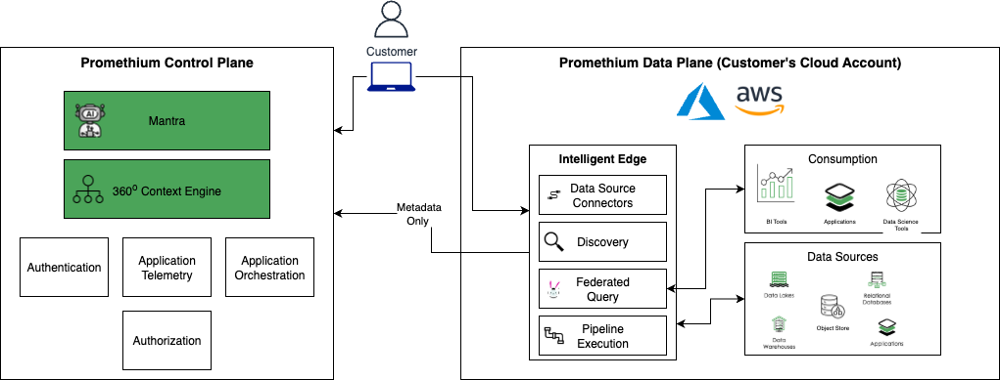

# ✅ Promethium Intelligent Edge Installation

Promethium utilizes a hybrid application architecture.

Promethium Control Plane. The Promethium Control Plane is hosted and managed by Promethium. The scope of the control plane is;

- Authentication
- Metadata
- Promethium’s agentic layer
- Application orchestration
- Application Telemetry

Promethium Data Plane (Intelligent Edge). The Promethium Data Plane is installed within the customers cloud provider as a private cluster. The data plane has connectivity to all data platforms. This ensures all data remains within the customers private network. Data exposed to an end user flows directly from the data plane to the users browser requiring all users to be part of the the customers private network. No data is exposed to the Promethium Control Plane. Customer is responsible for the management and monitoring of the Data Plane infrastructure. Promethium is responsible for the Application layer management and monitoring. The scope of the Data Plane is;

- Data Platform Connections
- Metadata Discovery
- Federated Query
- Pipeline Orchestration
- Data APIs

This repository contains the artifacts your team needs to install the Promethium Intelligent Edge in your cloud environment. It is designed for security, consistency, and minimal operational overhead.

## 🌐 Supported Platforms

- [**▶ AWS (EKS) Installation Guide**](./AWS/README.md)
- [**▶ Azure (AKS) Installation Guide**](./azure/README.md)

## 🧱 Installation Overview

The installation process includes:

1. Environment preparation (cloud privileges, networking, cluster setup)
2. Data plane creation (Terraform) and registration
3. Post-install validation and monitoring setup

The Intelligent Edge install process will provision a private kubernetes cluster. This requires the installation automation to run in a location that will have network access to the to private endpoint of the provisioned cluster. The simplest option is to provision a Linux VM in the VPC / VNET, that will contain the Intelligent Edge. This will allow the install process to complete kubernetes add-ons and application configuration.

The VM that the install automation will run on requires the following tools;

- [Helm : Version: 3](https://helm.sh/docs/intro/install/)
- [kubectl Version: 1.31.3](https://kubernetes.io/docs/tasks/tools/install-kubectl-linux/)
- [Terraform Version: v1.9.3](https://learn.hashicorp.com/tutorials/terraform/install-cli)
- [Git Version: 2.39.3](https://git-scm.com/book/en/v2/Getting-Started-Installing-Git)
- [AWS CLI Version: 2.18.13](https://docs.aws.amazon.com/cli/latest/userguide/getting-started-install.html)
- [Azure CLI: Version: 2.65.0](https://learn.microsoft.com/en-us/cli/azure/install-azure-cli)
- Python3 Version: 3.9.9

---
